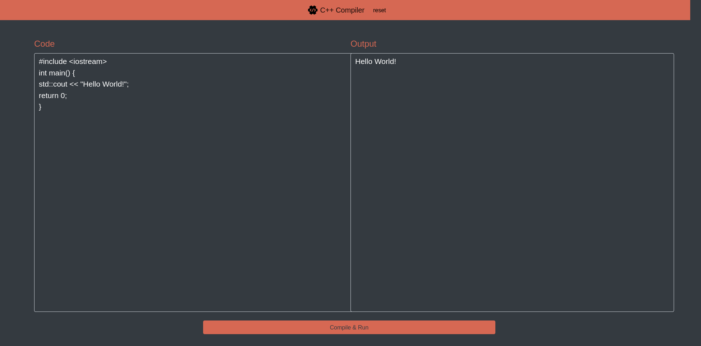

# Online C++ Compiler implemented using Python and Django
## Introduction
Cloud Computing Course Project

In this project, the aim is to implement an online C++ compiler as a web-app and deploy it on a PaaS provider.
## Installation
First, you need to clone this repository to your local machine via the following command:
```shell
$ git clone https://github.com/aylinghsr/Online_Cpp_Compiler.git
```
In case you don't have `git` installed on your computer, you can download the zip file of this repository and then, extract it.
## Requirements
This project is written in Python3 and requires Django.

You can install django via the following command:
```shell
$ pip install --user django
```
If the command above results in an error, you can also try:
```shell
$ python -m pip install --user django
```
## Usage
Run:
```shell
$ cd Online_Cpp_Compiler
$ python manage.py runserver
```
The server runs at [127.0.0.1:8000](127.0.0.1:8000)

After being redirected to the web-app, write your C++ code in the "Code" input and when you're done, hit "Compile & Run" button at the bottom of the page.

The following images are some examples of how this project work.

Hello World:


Power:


Sum:
